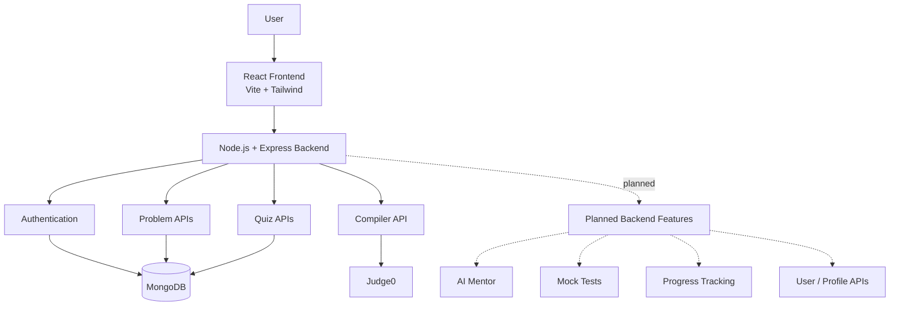

PrepNexus
This Project is a MERN stack interview preparation platform.
The goal is simple: give students one place to practice coding problems, write and run code, take technical quizzes, find coding contests, and later get help from an AI mentor.
⚠️ Current Status
Disclaimer: PrepNexus is still under active development.
The frontend is in progress and several pages are still basic or incomplete.
The backend is also in progress. The main working areas are authentication, coding problems, quizzes, and code execution. Other parts such as the AI Mentor backend, mock tests, progress tracking, user management, and some middleware are still being implemented.
This README describes the current state of the project, not a finished product.
Swagger/OpenAPI is not currently part of the project. The backend can be tested with normal API tools such as Postman or cURL. Swagger can be added later as API documentation, but it is not required for a MERN application.

What is PrepNexus?
Interview preparation usually means using many different websites:
- LeetCode for problems
- Other platforms for quizzes
- Separate websites for coding contests
- Separate tools for code execution
- AI tools for questions
- 
PrepNexus is an attempt to bring the main parts of that preparation into one application.

Main Features
Currently Implemented / Partly Implemented
- User registration
- User login
- JWT-based authentication
- Password hashing with bcrypt
- Coding problem sheets
- Blind 75
- NeetCode 150
- Striver SDE
- Grind 169
- Top Interview 150
- Problem search and filtering
- Problem details
- Problem examples and constraints
- Visible and hidden test cases
- Monaco code editor
- Code execution using Judge0
- Java, Python, JavaScript, C++ and C options
- Technical quiz data stored in MongoDB
- Random quiz question selection
- Coding contest platform links
- Basic dashboard
- Basic AI Mentor frontend
- 
Still Being Built
- Complete AI Mentor backend
- Complete mock test system
- Complete progress tracker
- Real user progress stored in MongoDB
- Better profile and user management
- Role-based access
- Central error handling
- Better quiz interface and scoring
- Complete dashboard analytics
- Full authentication protection for application pages
- More complete multi-language code execution
Architecture

PrepMate follows a normal MERN architecture.




Simple Flow
User
 ↓
React Frontend
 ↓
Express API
 ↓
Controllers / Services
 ↓
MongoDB or external service
 ↓
Response
 ↓
React Frontend


For code execution:
User writes code
      ↓
Monaco Editor
      ↓
Frontend prepares the code
      ↓
POST /api/compiler/run
      ↓
Express Backend
      ↓
Judge0
      ↓
Program executes
      ↓
Output returned
      ↓
Frontend compares output
Tech Stack
Frontend
- React
- Vite
- Tailwind CSS
- React Router
- Axios
- Monaco Editor
- Recharts
- Lucide React
- React Icons
- React Hot Toast
Backend
- Node.js
- Express
- MongoDB
- Mongoose
- Axios
- JSON Web Token
- bcryptjs
- dotenv- CORS

## External Services

- Judge0 for code execution
- Quiz API integration exists in the backend
- AI SDK dependencies are present, but the AI backend is still being implemented

## Project Structure

```text
SIP/
│
├── client/
│   ├── public/
│   │   ├── favicon.svg
│   │   └── icons.svg
│   │
│   └── src/
│       ├── api/
│       ├── components/
│       ├── context/
│       ├── data/
│       ├── layouts/
│       ├── pages/
│       ├── services/
│       ├── utils/
│       ├── App.jsx
│       └── main.jsx
│
└── server/
    ├── config/
    ├── controllers/
    ├── data/
    ├── middleware/
    ├── models/
    ├── quiz-json/
    ├── routes/
    ├── scripts/
    ├── services/
    ├── utils/
    └── server.js
```

## Backend Structure

The backend is split into small parts instead of keeping everything inside one file.

```text
server/
│
├── config/
│   ├── db.js
│   └── languages.js
│
├── controllers/
│   ├── aiController.js
│   ├── authController.js
│   ├── compilerController.js
│   ├── mockController.js
│   ├── problemController.js
│   ├── quizController.js
│   └── userController.js
│
├── middleware/
│   ├── authMiddleware.js
│   ├── errorMiddleware.js
│   └── roleMiddleware.js
│
├── models/
│   ├── MockTest.js
│   ├── Problem.js
│   ├── Progress.js
│   ├── Quiz.js
│   └── User.js
│
├── routes/
│   ├── aiRoutes.js
│   ├── authRoutes.js
│   ├── compilerRoutes.js
│   ├── mockRoutes.js
│   ├── problemRoutes.js
│   ├── quizRoutes.js
│   └── userRoutes.js
│
├── services/
│   ├── compilerService.js
│   └── quizApi.js
│
├── data/
│   ├── blind75.js
│   ├── grind169.js
│   ├── neetcode150.js
│   ├── striverSDE.js
│   └── topInterview150.js
│
├── quiz-json/
│   └── quiz question files
│
├── scripts/
│   └── seedQuiz.js
│
├── utils/
│   ├── generateToken.js
│   └── seedProblems.js
│
└── server.js
```


Current Backend APIs
Authentication
POST /api/auth/register
POST /api/auth/login
Registration creates a user and stores a hashed password.
Login checks the password and returns a JWT token.
Problems
GET /api/problems
GET /api/problems/filter?sheet=Blind75
GET /api/problems/:slug
The problem API reads problem data from MongoDB.
A problem can contain:
- Title
- Slug
- Description
- Difficulty
- Topic
- Constraints
- Examples
- Starter code
- Visible test cases
- Hidden test cases
- LeetCode link
- Tags
- Problem sheet

- 
Compiler
POST /api/compiler/run
The backend receives:
{
  "language_id": 62,
  "code": "your code",
  "input": ""

}
The request is sent to Judge0 and the result is returned to the frontend.
Quiz
GET /api/quiz/:technology
The backend:
1. Finds questions for the requested technology.
2. Randomly selects up to 20 questions.
3. Removes the answer and explanation from the response.
4. Sends the questions to the frontend.
Quiz questions are stored in MongoDB.


Authentication Flow
Register
   ↓
Password
   ↓
bcrypt hashing
   ↓
MongoDB
For login:
Email + Password
       ↓
Find User
       ↓
Compare Password
       ↓
JWT created
       ↓
Token returned
The repository also contains JWT authentication middleware, but the full protected-route system is still being connected.


Problem Solving Flow
A user can open a problem from one of the problem sheets.


Problem Sheet
     ↓
Problem Details
     ↓
Monaco Editor
     ↓
Choose Language
     ↓
Run / Submit
     ↓
Build executable source
     ↓
Judge0
     ↓
Compare output
     ↓
Solved / Wrong Answer

The frontend also stores solved problems and submitted code in browser localStorage.

That means the current solved status is local to the browser, not yet a proper database-backed user progress system.
Quiz Data
Quiz question files are stored inside:
server/quiz-json/
The project includes questions for technologies such as:
- Java
- Python
- JavaScript
- React
- Node.js
- MongoDB
- Linux
- Docker
- Git
- SQL
- HTML
- CSS
- Data Structures
- Generative AI
- FastAPI
- Operating Systems
- DBMS
- Computer Networks
- OOP
- DevOps
- Bash
- Kubernetes
- General Programming
  
The seeding script is:

server/scripts/seedQuiz.js
Problem Data
Problem collections are kept inside:
server/data/
The current collections are:
Blind 75
NeetCode 150
Striver SDE
Grind 169
Top Interview 150

The seeding script is:
server/utils/seedProblems.js

It combines the problem arrays and inserts them into MongoDB.
Frontend Structure
The frontend is built with React and uses React Router for page navigation.
Important pages include:
Login
Register
Dashboard
Problems
Problem Sheet
Problem Details
Quiz Dashboard
Quiz
Coding Contests
AI Mentor
Progress Tracker
Profile
The application also has reusable pieces such as:
MonacoEditor
Sidebar
Navbar
QuizCard
StatsCard
TopicPerformance
RecentActivity
WeakTopics

Some of these are complete, while some are still placeholders for future work.
Local Storage

The frontend currently uses localStorage for:
- Solved problem list
- Submitted code for problems
- Login token
- Basic user information
This is useful for the current frontend, but long-term progress should move to MongoDB so progress follows the user's account.
Environment Variables
Create a .env file inside server/.
Example:
PORT=5000
MONGO_URL=your_mongodb_connection_string
JWT_SECRET=your_jwt_secret
QUIZ_API_KEY=your_quiz_api_key
AI-related environment variables can be added when the AI Mentor backend is completed.
Running the Project

1. Clone the repository
git clone https://github.com/Rohitrajashekhar22/SIP.git

cd SIP

3. Start the backend

cd server
npm install
npm run dev


The backend normally runs on:
http://localhost:5000

5. Start the frontend
Open another terminal:
cd client
npm install
npm run dev

Vite will show the frontend URL in the terminal.
Seed Quiz Data
cd server
npm run seedQuiz
This reads the JSON files from:
server/quiz-json/
and inserts them into MongoDB.

Backend Work Still Needed
The backend already has a basic structure, but several parts need to be completed.
AI Mentor
The frontend already calls:
POST /api/ai/chat
but the current AI controller and route are still empty.
The backend still needs:
- AI route
- AI controller
- API/client setup
- environment variable handling
- proper error handling
- response format


Mock Tests
The project has placeholders for:
MockTest model
mockController
mockRoutes
mockApi


These need to be connected into a complete mock-test feature.
Progress Tracking
A Progress model exists as a placeholder.
The long-term plan is to store things such as:
- Problems solved
- Quiz attempts
- Quiz scores
- Streak
- Accuracy
- Topic performance
- Recent activity
in MongoDB instead of keeping the main progress data only in local storage.


User Management
The user model already contains basic fields such as:
- name
- email
- password
- streak
- accuracy
A complete user/profile system still needs to be added around this model.

Role-Based Access
A role middleware placeholder exists, but role-based permissions are not implemented yet.

Error Handling
A central error middleware placeholder exists and still needs to be connected.

Token Utility
A token utility file exists but is still empty. JWT creation is currently handled directly inside the authentication controller.

Known Development Issues
The repository is still being cleaned up, so some small integration issues are expected.
Examples include:
- Some frontend API files are still empty placeholders.
- Some React pages are only basic screens.
- The AI route is not registered in the current server setup.
- Mock and progress routes are not implemented yet.
- The current dashboard uses example/static values.
- The current progress system is mainly browser-based.
- C appears in the language selector, but the current frontend execution mapping does not yet provide a language ID for C.
- Some older files and newer implementations coexist while the project is being built.
- The external Quiz API service exists, while the current quiz controller mainly uses MongoDB quiz data.
- Swagger/OpenAPI documentation has not been added.


Future Goal
The final version of PrepNexus is intended to become a single preparation platform with:
Problems
   +
Quizzes
   +
Online Code Editor
   +
Mock Tests
   +
Progress Tracking
   +
AI Mentor
   +
Coding Contests
   +
User Profiles


The project is being developed step by step, so not every feature shown in the structure is finished yet.
Why This Project?
I built PrepNExus to practice building a real MERN application instead of only making small separate projects.
It covers:
- Frontend development
- REST APIs
- MongoDB
- Authentication
- External APIs
- Code execution
- Data seeding
- State management
- Problem-solving platforms
- AI integration
- Full-stack project structure
License
This project is currently shared for learning and development purposes.
